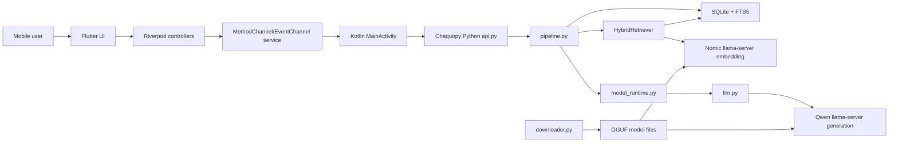
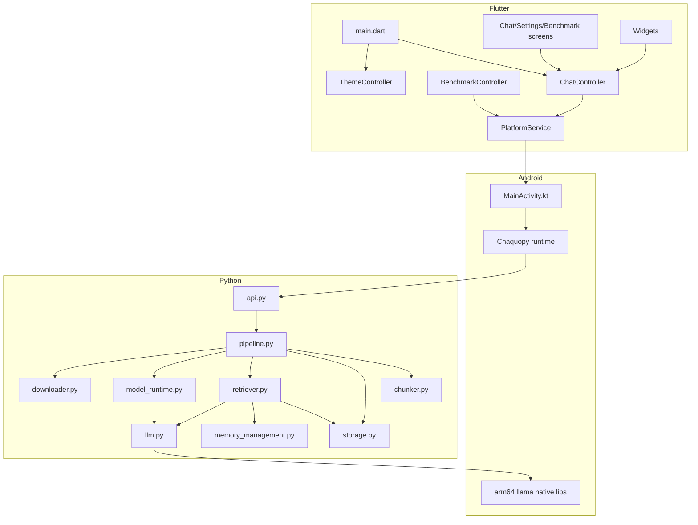
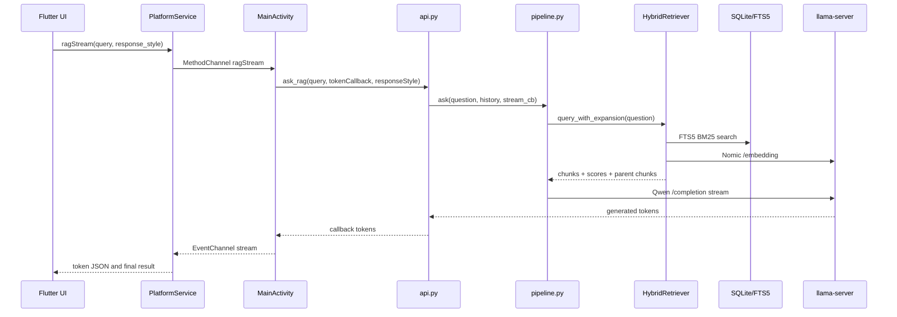
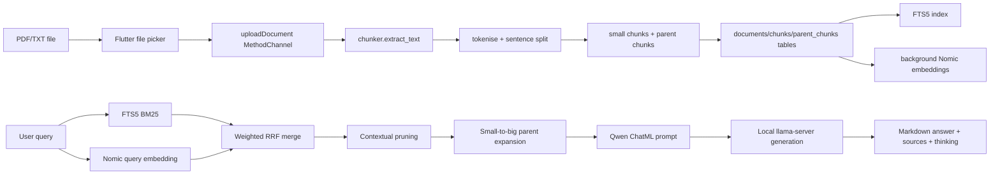

# O-RAG Technical Audit Report

Audit date: 2026-06-06

Scope: repository discovery, architecture reconstruction, Flutter analysis, Python backend analysis, LLM and RAG pipeline tracing, document processing, storage, memory, performance, security, deployment, IEEE readiness, and missing-information interview.

Important limitation: no GGUF model files were present in the repository during this audit. Model metadata such as exact parameter counts, embedding dimensions, tokenizer context limits, and file hashes therefore cannot be verified from local model headers. Those items are marked as missing or inferred where applicable.

## 1. Executive Summary

O-RAG is an offline-first mobile Retrieval-Augmented Generation assistant implemented as a Flutter application with an Android Kotlin bridge and an embedded Python backend through Chaquopy. The app lets users upload PDF and TXT documents, indexes them locally in SQLite with FTS5, retrieves context through sparse BM25 plus dense Nomic embeddings, and generates responses through a local llama.cpp `llama-server` runtime using GGUF models. Evidence: project description in `orag/pubspec.yaml:1-4`, README architecture in `orag/README.md:1-36`, Flutter entry point in `orag/lib/main.dart:10-66`, Kotlin channel bridge in `orag/android/app/src/main/kotlin/com/example/orag/MainActivity.kt:112-358`, and Python orchestration in `orag/android/app/src/main/python/api.py:230-568`.

The strongest verified implementation claim is: the production system is designed for local Android execution with local model inference, local retrieval, local SQLite persistence, and first-run online model download. Evidence: Android model path injection in `MainActivity.ensureApiModule` (`MainActivity.kt:83-110`), model download manifests in `downloader.py:33-54`, SQLite storage in `storage.py:26-175`, retrieval in `retriever.py:386-497`, and llama-server launch in `llm.py:439-567`.

Critical publication gaps remain: actual benchmark results on target hardware, final dataset description, baseline systems, evaluation protocol, exact GGUF metadata, model file hashes/revisions, confirmed license details, and security/privacy requirements. Some repository artifacts are evaluation helpers or synthetic notebook patchers and should not be treated as empirical evidence without confirmation. Evidence: runtime benchmark instrumentation exists in `benchmark_controller.dart:152-252`, but no production benchmark result set is committed; `base_reality.json` only contains extraction calibration values.

## 2. Repository Discovery

### 2.1 Folder Tree

Generated and cache-heavy trees are collapsed, but their existence was verified.

```text
.
|-- .deepeval/
|   `-- .deepeval/
|-- .git/
|-- .github/
|   `-- workflows/
|       `-- android-release.yml
|-- .idea/
|-- .vscode/
|-- build/                       # generated Flutter/Gradle/Chaquopy artifacts
|-- scratch/                     # local scratch area, currently dirty/deleted in git status
|-- 0_benchmark_hf_quantized_enhanced.ipynb
|-- Learning_Python.pdf
|-- base_reality.json
|-- benchmark_real_pdf.py
|-- generate_eval_notebooks.py
|-- ground_to_reality.py
|-- qna_evaluation.ipynb
|-- rag_memory_benchmark.ipynb
|-- rag_quality_eval.ipynb
|-- rag_quality_metrics.png
|-- ragas_evaluation.ipynb
|-- update_detailed_metrics.py
|-- update_matrix_full_pdf.py
`-- orag/
    |-- .dart_tool/              # generated Flutter metadata
    |-- .flutter-plugins-dependencies
    |-- README.md
    |-- analysis_options.yaml
    |-- assets/
    |   `-- logo.png
    |-- google_fonts/
    |-- pubspec.lock
    |-- pubspec.yaml
    |-- test/
    |   |-- chat_bubble_test.dart
    |   |-- platform_service_test.dart
    |   `-- widget_test.dart
    |-- lib/
    |   |-- main.dart
    |   |-- controllers/
    |   |   |-- benchmark_controller.dart
    |   |   |-- chat_controller.dart
    |   |   `-- theme_controller.dart
    |   |-- models/
    |   |   `-- chat_message.dart
    |   |-- screens/
    |   |   |-- benchmark_screen.dart
    |   |   |-- chat_screen.dart
    |   |   `-- settings_screen.dart
    |   |-- services/
    |   |   `-- platform_service.dart
    |   |-- theme/
    |   |   `-- app_theme.dart
    |   |-- utils/
    |   |   `-- benchmark_mock_data.dart
    |   `-- widgets/
    |       |-- benchmark_result_card.dart
    |       |-- chat_app_bar.dart
    |       |-- chat_bubble.dart
    |       |-- chat_input_bar.dart
    |       |-- chat_message_list.dart
    |       |-- document_drawer.dart
    |       |-- init_overlay.dart
    |       |-- thinking_dropdown.dart
    |       |-- top_snackbar.dart
    |       |-- typing_indicator.dart
    |       `-- upload_banner.dart
    |-- android/
    |   |-- app/
    |   |   |-- build.gradle.kts
    |   |   |-- chaquopy.gradle
    |   |   `-- src/main/
    |   |       |-- AndroidManifest.xml
    |   |       |-- jniLibs/arm64-v8a/
    |   |       |-- kotlin/com/example/orag/MainActivity.kt
    |   |       `-- python/
    |   |           |-- api.py
    |   |           |-- chunker.py
    |   |           |-- config.py
    |   |           |-- downloader.py
    |   |           |-- llm.py
    |   |           |-- memory_management.py
    |   |           |-- pipeline.py
    |   |           |-- retriever.py
    |   |           |-- storage.py
    |   |           `-- runtime/
    |   |               |-- bootstrap.py
    |   |               `-- model_runtime.py
    |   |-- build.gradle.kts
    |   |-- gradle.properties
    |   |-- gradle/wrapper/gradle-wrapper.properties
    |   `-- settings.gradle.kts
    |-- ios/
    |-- linux/
    |-- macos/
    |-- web/
    `-- windows/
```

### 2.2 Technology Inventory

| Layer | Technology | Evidence |
|---|---|---|
| UI | Flutter/Dart | `pubspec.yaml:1-21`, `main.dart:10-66` |
| State management | Riverpod | `main.dart:23`, `chat_controller.dart:534-538`, `theme_controller.dart:5-8` |
| Android bridge | Kotlin MethodChannel/EventChannel | `MainActivity.kt:14-16`, `MainActivity.kt:112-358` |
| Embedded backend | Python through Chaquopy | `build.gradle.kts:10-11`, `chaquopy.gradle:1-21` |
| Local AI runtime | llama.cpp `llama-server` binary | `llm.py:439-567`, `scripts/build_llama_android.sh:75-117` |
| LLM model format | GGUF | `downloader.py:33-54`, `README.md:29-36` |
| Sparse retrieval | SQLite FTS5 BM25 | `storage.py:117-123`, `storage.py:421-455` |
| Dense retrieval | Nomic embedding server | `llm.py:614-690`, `retriever.py:332-382` |
| Database | SQLite local DB | `storage.py:26-175` |
| CI/CD | GitHub Actions Android release workflow | `.github/workflows/android-release.yml:1-282` |
| Native build | CMake/Ninja for llama.cpp | `scripts/build_llama_android.sh:75-117` |

### 2.3 Package Inventory

Flutter direct dependencies are declared in `orag/pubspec.yaml:9-21` and locked in `orag/pubspec.lock`:

| Package | Version | Purpose | Evidence |
|---|---:|---|---|
| file_picker | 8.3.7 | PDF/TXT selection | `pubspec.lock:108-115`, `chat_controller.dart:415-420` |
| flutter_markdown | 0.7.7+1 | Assistant Markdown rendering | `pubspec.lock:129-136`, `chat_bubble.dart:280-370` |
| flutter_riverpod | 2.6.1 | State management | `pubspec.lock:145-152`, `chat_controller.dart:534-538` |
| flutter_tts | 4.2.5 | Text-to-speech | `pubspec.lock:158-165`, `chat_bubble.dart:22-57` |
| google_fonts | 6.3.3 | Local font assets | `pubspec.lock:179-186`, `main.dart:13-14` |
| intl | 0.20.2 | Date/number formatting support | `pubspec.lock:211-218` |
| path_provider | 2.1.5 | App storage paths | `pubspec.lock:347-354`, `chat_controller.dart:119`, `chat_controller.dart:494-497` |
| shared_preferences | 2.5.5 | Theme preference persistence | `pubspec.lock:427-434`, `theme_controller.dart:13-24` |
| speech_to_text | 7.4.0 | Speech input | `pubspec.lock:496-503`, `chat_input_bar.dart:49-91` |
| cupertino_icons | 1.0.9 | Icon dependency | `pubspec.lock:76-83` |

Python dependencies are installed by Chaquopy, not by a source `requirements.txt` file:

| Package | Evidence |
|---|---|
| numpy | `chaquopy.gradle:17` |
| certifi | `chaquopy.gradle:18`, TLS setup in `downloader.py:216-226` |
| huggingface_hub | `chaquopy.gradle:19`, helper import in `downloader.py:203-208` |
| pypdf | `chaquopy.gradle:20`, PDF fallback in `chunker.py:18-24` |

PyMuPDF is attempted first for PDF extraction but is not listed in the Chaquopy pip install block. Evidence: optional import in `chunker.py:12-17`; installed packages in `chaquopy.gradle:16-21`.

### 2.4 Dependency Inventory

Native Android libraries are present only under `orag/android/app/src/main/jniLibs/arm64-v8a/`, including `libllama_server.so`, `libllama.so`, `libllama-common.so`, `libggml*.so`, and `libmtmd.so`. Evidence: runtime binary lookup in `llm.py:196-240`, jniLibs source-set configuration in `build.gradle.kts:31-34`, and build script copy step in `scripts/build_llama_android.sh:115-117`.

The production app uses local HTTP only for llama-server endpoints on `127.0.0.1`. Evidence: ports in `config.py:13-14`, `/completion` request in `llm.py:737-799`, `/embedding` request in `llm.py:614-690`, and health probing in `llm.py:261-318`.

Online dependencies are first-run model downloads from Hugging Face URLs. Evidence: Qwen and Nomic URLs in `downloader.py:33-54` and HTTP download path in `downloader.py:229-356`.

### 2.5 Build System Inventory

| Build concern | Evidence |
|---|---|
| Flutter package/build system | `pubspec.yaml:1-32` |
| Dart lints | `analysis_options.yaml:10` |
| Android Gradle plugin 8.11.1 | `android/build.gradle.kts:7-9` |
| Kotlin 2.2.20 | `android/settings.gradle.kts:20-24` |
| Gradle 8.14 | `android/gradle/wrapper/gradle-wrapper.properties:5` |
| Java 17 | `android/app/build.gradle.kts:18-20`, `.github/workflows/android-release.yml:47-49` |
| Chaquopy plugin 15.0.1 | `android/build.gradle.kts:7-9`, `android/app/build.gradle.kts:10-11` |
| Native packaging for executable server binary | `android/app/build.gradle.kts:43-49` |
| Android release CI | `.github/workflows/android-release.yml:118-282` |
| llama.cpp Android build helper | `scripts/build_llama_android.sh:20-117` |

Portability issue: `orag/android/app/chaquopy.gradle:11` hard-codes `buildPython "D:/Work/8th_Sem/venv/Scripts/python.exe"`, while comments and CI imply an environment-driven build. This should be fixed or explained before publication.

## 3. Project Classification

Exact project type: offline-first mobile Retrieval-Augmented Generation assistant. Evidence: `pubspec.yaml:3`, `README.md:1-10`, `pipeline.py:413-522`, and `chat_controller.dart:227-396`.

Primary use case: users upload local PDF/TXT documents and ask questions grounded in those documents. Evidence: UI file filters in `chat_controller.dart:415-420` and `document_drawer.dart:57-61`; document ingestion in `pipeline.py:154-245`; RAG answering in `api.py:494-568`.

Secondary use cases:

- Direct local chatbot without document context. Evidence: `chat_controller.submitQuery` routes non-RAG prompts to `_submitChat` in `chat_controller.dart:227-310`, and Python direct chat uses `pipeline.chat_direct` in `pipeline.py:319-350`.
- Voice input and text-to-speech output. Evidence: `chat_input_bar.dart:49-91` and `chat_bubble.dart:22-57`.
- Built-in benchmark workflow for AI and RAG phases. Evidence: `benchmark_controller.dart:64-150` and `benchmark_screen.dart:73-301`.

Intended users inferred from code: mobile users who need document-grounded question answering without cloud dependency, plus developers/researchers measuring local AI behavior. This is partly documented in `README.md:1-6`; user personas are not explicitly defined in source.

Deployment model: Android APK/AAB with embedded Python code and native arm64 llama libraries, with models downloaded at runtime. Evidence: CI APK/AAB build in `.github/workflows/android-release.yml:214-235`, Android native library configuration in `build.gradle.kts:31-49`, and downloader manifests in `downloader.py:33-54`.

Runtime model: Flutter UI -> Kotlin bridge -> Chaquopy Python API -> retrieval/runtime modules -> local llama-server subprocesses -> streamed callbacks to Flutter. Evidence: `PlatformService` channels in `platform_service.dart:26-31`, Kotlin dispatch in `MainActivity.kt:150-358`, Python API in `api.py:392-568`, and llama-server calls in `llm.py:737-799`.

Offline capabilities: after models have been downloaded and local documents are ingested, direct chat, RAG retrieval, local database operations, and generation run locally. Evidence: local DB in `storage.py:26-175`, local llama-server in `llm.py:439-567`, and runtime Google Fonts fetching disabled in `main.dart:13-14`.

Online dependencies: first-run model download from Hugging Face and any evaluation notebooks that call cloud APIs. Evidence: `downloader.py:33-54`, `downloader.py:229-356`, and hard-coded evaluation API key cells in `ragas_evaluation.ipynb:70`, `ragas_evaluation.ipynb:75`, and `rag_quality_eval.ipynb:165`.

## 4. Architecture Reconstruction

### 4.1 High-Level Architecture



### 4.2 Module Graph



### 4.3 Service Interaction Graph



### 4.4 Data Flow Graph



## 5. Flutter Application Analysis

### 5.1 Application Structure

The Flutter application is organized by controller/model/screen/service/theme/widget folders under `orag/lib/`. The root app initializes Flutter, disables runtime Google Fonts fetching, locks portrait orientation, installs Riverpod, and renders `ChatScreen`. Evidence: `main.dart:10-66`.

### 5.2 State Management

State management uses Riverpod:

- `ChatController extends Notifier<ChatState>` and exposes `chatControllerProvider`. Evidence: `chat_controller.dart:76-538`.
- `ThemeController extends StateNotifier<ThemeMode>` and persists theme mode through SharedPreferences. Evidence: `theme_controller.dart:5-33`.
- `BenchmarkController extends StateNotifier<BenchmarkState>` and drives benchmark phases. Evidence: `benchmark_controller.dart:55-310`.

State flow:

1. UI events call `ChatController` methods. Evidence: `chat_screen.dart:45-69`.
2. Controller calls `PlatformService`. Evidence: `chat_controller.dart:121-148`, `chat_controller.dart:262-265`, `chat_controller.dart:329-332`, `chat_controller.dart:449-464`.
3. Streamed tokens update the last assistant message through a 50 ms batching buffer. Evidence: `chat_controller.dart:82-89`, `chat_controller.dart:203-223`.
4. Messages are persisted as JSON, excluding active streaming messages, capped to the last 100. Evidence: `chat_controller.dart:494-531`.

### 5.3 Navigation

The app does not define named routes or deep links. `MaterialApp.home` is `ChatScreen`, settings are opened by `Navigator.push(MaterialPageRoute(...))`, and benchmark is opened from settings. Evidence: `main.dart:63`, `chat_screen.dart:71-80`, and `settings_screen.dart:646-653`.

### 5.4 UI Screen Inventory

| Screen | Purpose | State/dependencies | Evidence |
|---|---|---|---|
| ChatScreen | Main chat, RAG toggle, document drawer, input, init overlay | `ChatController`, `PlatformService` | `chat_screen.dart:20-194` |
| SettingsScreen | Theme, engine health, resource report, clear actions, benchmark entry | `ThemeController`, `PlatformService` | `settings_screen.dart:10-732` |
| BenchmarkScreen | Runs and displays local benchmark phases | `BenchmarkController` | `benchmark_screen.dart:11-301` |

### 5.5 UI Feature Inventory

| Feature | Implementation | Evidence |
|---|---|---|
| Chat/direct mode and document mode toggle | `ChatController.toggleRagMode`, app-bar toggle | `chat_controller.dart:178-187`, `chat_app_bar.dart:334-398` |
| Markdown assistant responses | `MarkdownBody` configuration | `chat_bubble.dart:280-370` |
| Source attribution modal | Source and parent chunk grouping | `chat_bubble.dart:388-725` |
| Thinking display | Thinking dropdown/modal | `thinking_dropdown.dart:5-196`, `chat_bubble.dart:372-386` |
| Speech input | `speech_to_text` initialization/listen | `chat_input_bar.dart:49-91` |
| TTS output | static `FlutterTts` instance and toggle | `chat_bubble.dart:22-57` |
| Document upload/delete/clear | Drawer plus platform calls | `document_drawer.dart:57-131` |
| Benchmark reporting | Temp doc creation, metrics, Markdown export | `benchmark_controller.dart:64-304` |

### 5.6 Flutter Storage

| Storage | Data | Evidence |
|---|---|---|
| SharedPreferences | Theme mode under `orag_theme_mode` | `theme_controller.dart:13-24` |
| App documents JSON | Last 100 chat messages in `orag_messages.json` | `chat_controller.dart:494-531` |
| Android external/app storage path | Model directory passed to Python init | `chat_controller.dart:119-148` |

No Hive, Isar, ObjectBox, or Flutter-side SQLite package is used. SQLite is managed in Python.

## 6. Python Backend Analysis

### 6.1 Backend Type

There is no Flask, FastAPI, Django, or external HTTP API framework. The Python backend is a Chaquopy-loaded module invoked from Kotlin through direct Python calls. Evidence: `MainActivity.ensureApiModule` imports Python module `api` in `MainActivity.kt:83-110`; method dispatch calls Python functions in `MainActivity.kt:150-358`; `api.py` exposes functions such as `init_with_progress`, `chat_stream`, `upload_document`, and `ask_rag` in `api.py:230-568`.

### 6.2 Request-to-Response Trace

Direct chat:

1. Flutter calls `PlatformService.chatStream`. Evidence: `platform_service.dart:146-192`.
2. Kotlin handles `chatStream`. Evidence: `MainActivity.kt:188-215`.
3. Python `api.chat_stream` validates readiness and streaming state. Evidence: `api.py:392-435`.
4. `pipeline.chat_direct` builds a direct prompt and calls the runtime. Evidence: `pipeline.py:319-350`.
5. `llm.generate` calls llama-server or fallback backend. Evidence: `llm.py:1033-1078`.
6. Tokens return through callback/EventChannel. Evidence: `MainActivity.kt:50-58`, `platform_service.dart:146-192`.

RAG chat:

1. Flutter calls `PlatformService.ragStream`. Evidence: `platform_service.dart:266-313`.
2. Kotlin handles `ragStream`. Evidence: `MainActivity.kt:302-323`.
3. Python `api.ask_rag` handles cache, readiness, history, and token callback. Evidence: `api.py:494-568`.
4. `pipeline.ask` retrieves chunks, builds context, builds prompt, generates answer. Evidence: `pipeline.py:413-522`.

Document ingestion:

1. Flutter file picker restricts to PDF/TXT. Evidence: `chat_controller.dart:415-420`, `document_drawer.dart:57-61`.
2. Kotlin calls `api.upload_document`. Evidence: `MainActivity.kt:257-269`.
3. `pipeline.ingest_document` extracts text, chunks, persists, and reloads retriever. Evidence: `pipeline.py:154-245`.

### 6.3 API Inventory

| API surface | Request | Response | Evidence |
|---|---|---|---|
| `initPython` | model path string | init status JSON/events | `platform_service.dart:42-121`, `MainActivity.kt:153-181`, `api.py:230-327` |
| `getStatus` | none | cached init status | `platform_service.dart:123-139`, `MainActivity.kt:182-187`, `api.py:329-349` |
| `chatStream` | query, response_style | streamed tokens + final JSON | `platform_service.dart:146-192`, `MainActivity.kt:188-215`, `api.py:392-435` |
| `chat` | query | answer JSON | `MainActivity.kt:216-231`, `api.py:356-390` |
| `stop` | none | bool | `platform_service.dart:194-201`, `MainActivity.kt:232-242`, `api.py:123-125` |
| `clearMemory` | none | bool | `platform_service.dart:203-206`, `MainActivity.kt:243-253`, `api.py:117-121` |
| `uploadDocument` | path string | document status map | `platform_service.dart:210-221`, `MainActivity.kt:257-269`, `api.py:442-451` |
| `listDocuments` | none | document list | `platform_service.dart:223-233`, `MainActivity.kt:271-279`, `api.py:454-463` |
| `deleteDocument` | doc_id int | bool | `platform_service.dart:235-247`, `MainActivity.kt:281-289`, `api.py:466-474` |
| `clearDocuments` | none | bool | `platform_service.dart:249-259`, `MainActivity.kt:291-298`, `api.py:477-486` |
| `ragStream` | query, response_style | streamed tokens + sources/thinking/parents | `platform_service.dart:266-313`, `MainActivity.kt:302-323`, `api.py:494-568` |
| `getEngineHealth` | none | backend/model/doc health | `platform_service.dart:317-326`, `MainActivity.kt:325-333`, `api.py:575-609` |
| `getResourceUsage` | none | RAM/CPU/battery/profile report | `platform_service.dart:328-337`, `MainActivity.kt:343-353`, `api.py:616-622`, `memory_management.py:453-514` |
| `getInitLogs` | none | log text | `platform_service.dart:341-349`, `MainActivity.kt:335-341`, `api.py:611-614` |

There is no authentication, authorization, request schema library, or middleware layer in the local MethodChannel API.

## 7. LLM Analysis

### 7.1 Model Inventory

| Model | Verified source | File | Quantization evidence | Missing |
|---|---|---|---|---|
| Qwen 3.5 2B | `cracker0935/Compressed_RAG_Models` | `Qwen3.5-2B-Q4_K_M.gguf` | `Q4_K_M` in filename | exact hash, GGUF metadata, tokenizer limit, license |
| Nomic Embed v1.5 | `cracker0935/Compressed_RAG_Models` | `nomic-embed-text-v1.5-compressed.gguf` | unclear in production code | exact quantization, dimensions, hash, license |

Evidence: model manifests in `downloader.py:33-54`; README model table in `README.md:29-36`.

Note: `README.md:31-34` says Nomic is `Q8_0`, while `downloader.py:44-52` names a compressed Nomic file without a quantization suffix. This needs confirmation before publication.

### 7.2 Runtime and Inference Engine

Primary Android runtime is llama.cpp `llama-server` launched as a native subprocess. Evidence: server binary discovery in `llm.py:196-240`, launch logic in `llm.py:343-507`, and Android packaging comment in `build.gradle.kts:43-49`.

Backend fallbacks exist for development or non-Android cases:

- `llama-cpp-python` if importable. Evidence: `llm.py:128-137`, `llm.py:926-939`.
- Ollama if reachable. Evidence: `llm.py:140-147`, `llm.py:943-949`, `llm.py:1111-1141`.
- External llama-server connection. Evidence: `llm.py:1020-1028`.

GPU use is disabled for the llama-server path through `--n-gpu-layers 0`. Evidence: `llm.py:469`.

### 7.3 Prompt Templates

RAG prompts use Qwen ChatML formatting, insert optional conversation summary, last three turns, context chunks, and the user question. Evidence: `llm.build_rag_prompt` in `llm.py:1279-1359`.

Direct chat prompts use ChatML, optional summary, last three turns, and either detailed or concise system messages. Evidence: `llm.build_direct_prompt` in `llm.py:1391-1436`.

The prompt response style is selected in Flutter and passed to Python as `response_style`. Evidence: dropdown/control in `chat_app_bar.dart:149-242`, PlatformService request fields in `platform_service.dart:170-174` and `platform_service.dart:290-294`, and Python handling in `api.py:392-435` and `api.py:494-568`.

### 7.4 Generation Parameters

For llama-server generation:

| Parameter | Value/source | Evidence |
|---|---|---|
| temperature | default 0.3 | `llm.py:889-893`, payload in `llm.py:737-747` |
| top_p | default 0.8 | `llm.py:889-893`, `llm.py:737-747` |
| top_k | 20 | `llm.py:737-747` |
| presence_penalty | 1.5 | `llm.py:737-747` |
| repetition_penalty | not configured | absence from payload in `llm.py:737-747` |
| stop tokens | `<|im_end|>`, `<|im_start|>`, `</s>` | `llm.py:737-747` |
| max tokens | profile/safety capped | `memory_management.py:174-270`, `pipeline.py:378-397`, `llm.py:719-730` |
| context window | profile-based, 1536 to 4096 in known RAM profiles | `memory_management.py:200-270` |
| cache prompt | true | `llm.py:737-747` |

Thinking extraction/suppression is handled by `_strip_thinking` and `_ThinkingStreamFilter`. Evidence: `llm.py:1148-1273`.

## 8. RAG Pipeline Report

### 8.1 End-to-End Pipeline

Document -> parsing -> cleaning/chunking -> SQLite/FTS5 storage -> optional dense embedding -> sparse+dense retrieval -> weighted RRF -> contextual pruning -> parent expansion -> context formatting -> prompt assembly -> local LLM response.

Evidence path:

- Ingestion entry: `pipeline.ingest_document` in `pipeline.py:154-245`.
- Parsing/chunking: `chunker.py:135-257` and `chunker.py:348-484`.
- Storage: `storage.py:65-175`, `storage.py:239-297`.
- Retrieval: `retriever.py:386-497`.
- Prompt assembly: `pipeline.py:478-490`, `llm.py:1279-1359`.
- Generation: `pipeline.py:493-512`, `llm.py:1033-1078`.

### 8.2 Chunking

| Item | Verified implementation | Evidence |
|---|---|---|
| Small chunk target | 100 tokens/words | `chunker.py:31-34`, `chunker.py:210-257` |
| Small chunk overlap | semantic overlap from last two sentences; constant overlap 20 for non-semantic helper | `chunker.py:31-34`, `chunker.py:248-251` |
| Parent chunk size | 400 words | `chunker.py:31-34`, `chunker.py:348-414` |
| Parent overlap | 50 words | `chunker.py:31-34`, `chunker.py:348-414` |
| Parent mapping | small chunk midpoint mapped into parent chunk ranges | `chunker.py:388-405` |
| Cleaning/tokenization | lower-case regex tokens with stopword removal | `chunker.py:148-154` |

### 8.3 Embeddings

Dense embeddings are generated by sending prefixed text to the Nomic llama-server `/embedding` endpoint. Document chunks use `search_document:` and queries use `search_query:`. Evidence: chunk embedding in `retriever.py:253-261`, query embedding in `retriever.py:346-349`, and endpoint implementation in `llm.py:614-690`.

Embedding dimensions are not verified in production code. Evaluation notebook text references 768 dimensions, but this is not runtime proof. Production paper claims should confirm from the actual GGUF or model card.

### 8.4 Retrieval

| Stage | Implementation | Evidence |
|---|---|---|
| Sparse | SQLite FTS5 BM25 search | `storage.py:421-455`, `retriever.py:325-328` |
| Dense | Cosine similarity over cached embeddings | `retriever.py:35-45`, `retriever.py:332-382` |
| Fusion | Weighted Reciprocal Rank Fusion, dense 0.7, sparse 0.3 | `retriever.py:52-76` |
| Parallel search | sparse and dense futures with timeout | `retriever.py:405-415` |
| Pruning | max 2 results, min score ratio profile-based | `retriever.py:79-106`, `retriever.py:427-436` |
| Small-to-big | top small chunks expanded to parent chunks | `retriever.py:457-497`, `storage.py:276-297` |

Important performance/quality limitation: dense embeddings are only computed for a profile-dependent prefix of chunks (`embed_chunk_limit`), while sparse FTS5 covers the full corpus. Evidence: `retriever.py:230-244` and profile limits in `memory_management.py:200-270`. For large corpora, dense retrieval may not cover all chunks unless this limit is increased or embeddings are completed incrementally.

### 8.5 Context Injection

Context chunks are formatted as `[Source: document_name]\ntext`, joined into the RAG prompt, and returned as source previews with scores. Evidence: `pipeline.py:478-508`.

Parent chunks are returned to Flutter and displayed in source modals. Evidence: Python result construction in `pipeline.py:513-520`, `api.py:543-555`, Dart model fields in `chat_message.dart:32-57`, and UI grouping in `chat_bubble.dart:467-725`.

Citation formatting is implemented as source attribution metadata, not as formal inline bibliographic citations. Evidence: `SourceAttribution` in `chat_message.dart:5-30` and source UI in `chat_bubble.dart:388-725`.

## 9. Document Processing Analysis

| File type | Support status | Parser/process | Evidence |
|---|---|---|---|
| PDF | Supported | PyMuPDF if available, else pypdf fallback | `chunker.py:12-24`, `chunker.py:57-72` |
| TXT | Supported | UTF-8 text read with ignore errors | `chunker.py:52-54`, `chunker.py:135-141` |
| DOCX | Not supported in production UI/backend | No file picker extension or parser | `chat_controller.dart:415-420`, `chunker.py:135-141` |
| MD | Not separately supported; would be treated as TXT only if path manually passed | No picker extension | `document_drawer.dart:57-61`, `chunker.py:135-141` |
| CSV | Not supported | No parser found | `chunker.py:135-141` |
| Images | Not supported for document ingestion/OCR | No OCR parser found | `chunker.py:135-141` |

Android content URI resolution exists in `chunker.resolve_uri`, using `jnius` and copying content streams to temp files. Evidence: `chunker.py:75-132`. Flutter currently passes file paths returned by `file_picker`, so content URI behavior should be tested before claiming robust Android URI support. Evidence: `chat_controller.dart:415-464`.

## 10. Storage and Database Analysis

SQLite DB path is app-private on Android through `ANDROID_PRIVATE`, with a home-directory fallback for development. Evidence: `storage.py:26-29`.

Schema:

```mermaid
erDiagram
    documents ||--o{ chunks : has
    documents ||--o{ parent_chunks : has
    chunks ||--|| chunks_fts : indexed_by

    documents {
        integer id PK
        text name
        text path UNIQUE
        text added_at
        integer num_chunks
    }
    chunks {
        integer id PK
        integer doc_id FK
        integer chunk_idx
        text text
        integer tokens
        text tfidf_vec
        integer parent_chunk_idx
        blob embedding
    }
    parent_chunks {
        integer id PK
        integer doc_id FK
        integer parent_chunk_idx
        text text
    }
    chunks_fts {
        text text
    }
```

Evidence: table definitions in `storage.py:80-123`, triggers in `storage.py:127-149`, migrations in `storage.py:151-168`, and embedding BLOB pack/unpack in `storage.py:182-190`.

Storage strategies:

- WAL mode, normal synchronous mode, foreign keys, cache size, and mmap are configured per connection. Evidence: `storage.py:40-51`.
- FTS5 triggers keep the full-text table synchronized. Evidence: `storage.py:127-149`.
- Embeddings are persisted in the `chunks.embedding` BLOB column. Evidence: `storage.py:370-404`.
- Chat history is stored separately as Flutter JSON. Evidence: `chat_controller.dart:494-531`.

No external vector database is used.

## 11. Memory Management Report

The backend computes an adaptive memory profile from device RAM and battery state. Evidence: `memory_management.py:174-270`.

Profiles:

| Profile | RAM condition | Qwen context | Max tokens | Nomic context | Embedding limit | Evidence |
|---|---:|---:|---:|---:|---:|---|
| UNKNOWN/LOW fallback | unknown RAM | 384 | 256 | 128 | 20 | `memory_management.py:184-198` |
| ULTRA_LOW | <= 3 GB | 1536 | 256 | 64 | 15 | `memory_management.py:200-217` |
| LOW | <= 4.5 GB | 2048 | 512 | 64 | 25 | `memory_management.py:219-237` |
| MEDIUM | <= 6.5 GB | 3072 | 768 | 384 | 50 | `memory_management.py:239-254` |
| HIGH | > 6.5 GB | 4096 | 1024 | 512 | 100 | `memory_management.py:256-270` |

Cache and memory behavior:

- Conversation history is capped and summarized in Python. Evidence: `api.py:74-114`.
- API response cache is FIFO with 20 entries. Evidence: `api.py:22-47`.
- Retriever keeps chunks, indexes, and embeddings in memory. Evidence: `retriever.py:128-190`.
- Nomic server can start lazily/eagerly and be stopped under low memory. Evidence: `memory_management.py:383-446`, `retriever.py:297-304`.
- Memory pressure clamps context, tokens, batch size, and embedding limits. Evidence: `memory_management.py:300-372`.

Potential bottlenecks:

1. `retriever.reload` loads all chunk text/metadata into memory. Evidence: `storage.py:300-324`, `retriever.py:148-190`.
2. Dense embedding coverage is limited by `embed_chunk_limit`, which can reduce retrieval quality for large document sets. Evidence: `retriever.py:230-244`.
3. First-run model download and llama-server startup may dominate initialization latency. Evidence: `downloader.py:363-499`, `api.py:230-327`, `llm.py:439-567`.
4. Root calibration data shows `Learning_Python.pdf` extraction/chunking produced 5200 chunks in 16.788 seconds, but this is one calibration artifact, not a full benchmark suite. Evidence: `base_reality.json`.

## 12. Performance Analysis

Instrumentation exists, but complete empirical results are not committed.

Available instrumentation:

| Metric | Instrumentation | Evidence |
|---|---|---|
| TTFT | first streamed token timestamp | `benchmark_controller.dart:173-199` |
| Response latency | stopwatch over stream | `benchmark_controller.dart:170-212` |
| Tokens/sec | estimated token count / elapsed time | `benchmark_controller.dart:210-214` |
| Peak RAM | max from `getResourceUsage` polling | `benchmark_controller.dart:164-207` |
| CPU percent | reported from backend resource usage | `benchmark_controller.dart:164-207`, `memory_management.py:453-514` |
| Document extraction calibration | extraction time and chunk count | `benchmark_real_pdf.py:28-53`, `base_reality.json` |

Known committed calibration value: `base_reality.json` contains `extraction_time = 16.788479566574097`, `num_chunks = 5200`, and `calibration_value = 0.08221578598022461`. Treat this as calibration, not final RAG evaluation.

Missing performance evidence for publication:

- model load time across devices
- first-run download time
- embedding generation time per document/chunk
- retrieval latency per query
- end-to-end RAG latency
- TTFT/TPS by model/profile/device
- memory peak during concurrent Qwen and Nomic runtime
- repeatability across runs

## 13. Security Analysis

Security model: no authentication or authorization is implemented because the app is local and user-facing. Evidence: MethodChannel API in `MainActivity.kt:150-358` and Python API functions in `api.py:356-622` contain no auth checks.

Privacy strengths:

- Document storage, retrieval, and generation are local after model download. Evidence: `storage.py:26-175`, `llm.py:439-799`.
- Runtime font fetching is disabled. Evidence: `main.dart:13-14`.

Risks:

1. Evaluation notebooks contain hard-coded cloud API tokens. Values should be revoked/rotated and removed from history. Evidence: `ragas_evaluation.ipynb:70`, `ragas_evaluation.ipynb:75`, `rag_quality_eval.ipynb:165`.
2. Local SQLite database and Flutter chat JSON are not encrypted. Evidence: DB path/schema in `storage.py:26-175`; chat JSON persistence in `chat_controller.dart:494-531`.
3. Android permissions include Internet and microphone recording. Evidence: `AndroidManifest.xml:2-7`.
4. The app downloads model files over HTTPS but does not verify pinned hashes in the downloader. Evidence: URL download path in `downloader.py:229-356` and manifest fields in `downloader.py:33-54`.
5. App target platforms include iOS/macOS scaffolds, but iOS speech permission descriptions were not found in `Info.plist`; if iOS is a real target, speech features may fail compliance/runtime permission checks.

Offline security advantage: the production inference path does not require sending user documents or prompts to a cloud LLM after model files exist locally. Evidence: local generation path in `llm.py:737-799` and local retrieval path in `retriever.py:386-497`.

## 14. Deployment Analysis

Deployment is best evidenced as Android-first. Evidence: Android-specific Chaquopy backend, native arm64 llama libraries, and Android release CI in `.github/workflows/android-release.yml:118-282`.

Runtime requirements from code:

| Requirement | Evidence |
|---|---|
| Android app runtime with Flutter engine | `MainActivity.kt:112-358` |
| Java 17 build environment | `build.gradle.kts:18-20`, workflow `:47-49` |
| Python 3.11 build support in CI | `.github/workflows/android-release.yml:202-209` |
| Android native llama-server binary | `jniLibs/arm64-v8a/libllama_server.so`, `llm.py:196-240` |
| CPU-only inference | `llm.py:469` |
| RAM-adaptive profile from <=3 GB through >6.5 GB | `memory_management.py:200-270` |
| Online access on first model download | `downloader.py:229-356` |

Potential deployment issue: Chaquopy ABI filters include `armeabi-v7a`, `arm64-v8a`, and `x86_64`, but the native llama libraries are present only under `arm64-v8a`. Evidence: `chaquopy.gradle:7-9` and `android/app/src/main/jniLibs/arm64-v8a/`. Non-arm64 APK targets may not have a working llama-server binary unless additional binaries are provided.

## 15. Design Decision Analysis

The code verifies what was selected, but not always why it was selected.

| Decision | Evidence-backed fact | Rationale status |
|---|---|---|
| Flutter | App uses Flutter and includes platform scaffolds | Rationale inferred as cross-platform/mobile UI; needs confirmation |
| Python | RAG/AI backend embedded via Chaquopy | Rationale inferred as AI ecosystem reuse; needs confirmation |
| llama.cpp/GGUF | Native llama-server used locally | Rationale inferred as offline CPU inference; supported by code |
| SQLite/FTS5 | Local DB and sparse retrieval | Rationale inferred as lightweight offline storage; supported by code |
| Qwen 3.5 2B Q4_K_M | Downloader and README identify model | Selection rationale and license need confirmation |
| Nomic Embed v1.5 | Downloader and README identify model family | Quantization and selection rationale need confirmation |
| Weighted hybrid retrieval | Dense/sparse wRRF implemented | Rationale supported by retriever docstring and code, but evaluation evidence missing |

## 16. Codebase Consistency Findings

These are not necessarily fatal defects, but they matter for paper accuracy and reproducibility.

1. Nomic quantization mismatch: README says Nomic Q8_0, downloader names a compressed GGUF without a quantization suffix. Evidence: `README.md:31-34`, `downloader.py:44-52`.
2. Hard-coded local Python build path can break other machines/CI. Evidence: `chaquopy.gradle:11`.
3. Native libraries are arm64-only while ABI filters include three ABIs. Evidence: `chaquopy.gradle:7-9`, `jniLibs/arm64-v8a/`.
4. `api.get_status` references `bs_mod.get_bootstrap_event()`, but `runtime/bootstrap.py` defines `BootstrapCoordinator.get_bootstrap_event`, not a module-level function. Evidence: `api.py:329-349`, `runtime/bootstrap.py:26-82`.
5. `generate_eval_notebooks.py` imports `CHUNK_SIZE` from `config.py`, but `CHUNK_SIZE` is defined in `chunker.py`. Evidence: `generate_eval_notebooks.py:31-45`, `config.py:9-22`, `chunker.py:31-34`.
6. `memory_management.py` top docstring describes profile values that do not match current implementation values. Evidence: docstring `memory_management.py:1-18`, actual profiles `memory_management.py:174-270`.
7. Evaluation notebooks include hard-coded external API secrets. Evidence: `ragas_evaluation.ipynb:70`, `ragas_evaluation.ipynb:75`, `rag_quality_eval.ipynb:165`.

## 17. IEEE Readiness Matrix

| Section | Available information | Inferred information | Missing information | Confidence |
|---|---|---|---|---|
| Abstract | Offline mobile RAG architecture, local inference | User benefit and novelty | Final quantitative claims | Medium |
| Keywords | Offline RAG, Flutter, llama.cpp, SQLite FTS5, mobile LLM | Edge AI/mobile assistant framing | Venue-specific taxonomy | High |
| Introduction | Problem addressed by offline document Q&A | Motivation around privacy/connectivity | User/domain requirements | Medium |
| Literature Review | None in source | Compare with cloud RAG, mobile LLMs | Related work sources | Low |
| Problem Statement | Offline document QA implied | Need privacy/locality/low cloud dependency | Formal problem definition | Medium |
| Methodology | Pipeline and runtime fully traceable | Hybrid retrieval rationale | Evaluation method and baselines | Medium |
| Architecture | Strong code evidence and graphs | Android-first deployment | Confirm non-Android intent | High |
| System Design | Components, storage, prompts, memory profiles | Tradeoffs | Design rationale interviews | High |
| Implementation | Source-backed details | Minor rationale | Model hashes/licensing | High |
| Experimental Setup | Benchmark controller and calibration script | Likely device metrics intended | Actual hardware/results/datasets | Low |
| Results | No final results committed | Synthetic notebooks not authoritative | Verified benchmark tables | Low |
| Evaluation | RAGAS/quality notebooks exist | Intended evaluation dimensions | Ground truth and baseline protocol | Low |
| Comparative Analysis | Baseline categories can be defined | Cloud vs local hypotheses | Actual baseline runs | Low |
| Discussion | Known tradeoffs and risks | Offline privacy advantage | User feedback and limitations evidence | Medium |
| Limitations | Dense coverage limit, no OCR/DOCX, local storage security | Device resource constraints | Confirmed user-facing constraints | Medium |
| Future Work | Encryption, broader formats, baselines, full embedding coverage | Cross-platform support | Prioritized roadmap | Medium |
| Conclusion | System can be summarized | Impact claims | Quantified validation | Medium |

## 18. Comparative Evaluation Requirements

The repository does not yet contain enough verified evidence to compare rigorously against:

1. Cloud LLM systems.
2. Cloud RAG systems.
3. Local desktop LLM systems.
4. Offline mobile assistants.
5. Mobile AI assistants using smaller/slower/faster models.

Required benchmark data:

- same document corpus and question set across systems
- answer quality metrics with ground truth
- latency metrics: retrieval, TTFT, total response, TPS
- resource metrics: RAM, CPU, storage, battery impact
- privacy/network comparison
- reproducible hardware and software environment

Existing code can collect some O-RAG metrics through `BenchmarkController`, but comparable baselines must be defined and run externally. Evidence: `benchmark_controller.dart:152-252`.

## 19. Experimental Setup Extraction

Available:

- App-level benchmark phases: initialization, AI tests, RAG document upload, RAG tests, cleanup. Evidence: `benchmark_controller.dart:64-150`.
- AI/RAG test questions are hard-coded in the benchmark controller. Evidence: `benchmark_controller.dart:72-120`.
- Benchmark mock corpus is hard-coded in Flutter. Evidence: `benchmark_mock_data.dart:1-62`.
- Resource usage exposes RAM, battery, profile, Nomic state, and CPU estimate. Evidence: `memory_management.py:453-514`.
- `base_reality.json` provides one calibration record: 16.788 second extraction, 5200 chunks, calibration value 0.0822.

Missing:

- CPU model
- GPU/NPU availability
- RAM of tested devices
- Android version
- model load time
- embedding generation time
- retrieval latency
- response latency distributions
- TTFT/TPS distributions
- dataset sizes and document types
- number of queries/documents/users
- evaluation methodology and statistical treatment

## 20. Missing Information Interview

Answer these in priority order. They are only questions that could not be fully answered from code.

| Priority | Question | Why required |
|---|---|---|
| P0 | What exact devices were used or will be used for evaluation: CPU, RAM, Android version, storage type, and battery condition? | Needed for experimental setup and reproducibility. |
| P0 | Can you provide real benchmark outputs for model load time, embedding time, retrieval latency, TTFT, TPS, total latency, RAM peak, and CPU usage? | Needed for Results and Evaluation sections. |
| P0 | What dataset/corpus and question set should be used for final evaluation, and is there ground truth? | Needed for quality metrics and comparative evaluation. |
| P0 | Which baseline systems should O-RAG be compared against? | Needed for comparative analysis. |
| P0 | Can you provide actual GGUF files or metadata: SHA256 hashes, exact model revisions, licenses, context limits, embedding dimensions, and quantization? | Needed to avoid unverifiable model claims. |
| P1 | Is Android the only intended deployment target, or should iOS/web/desktop scaffolds be treated as active targets? | Needed for deployment architecture and limitations. |
| P1 | Should local database/chat history encryption be a requirement? | Needed for security model and privacy claims. |
| P1 | What is the intended user group: students, researchers, enterprise users, field workers, or general mobile users? | Needed for introduction, use cases, and evaluation design. |
| P1 | What is the intended novelty claim: offline mobile RAG integration, resource-adaptive inference, hybrid retrieval, or privacy-preserving local QA? | Needed for paper framing. |
| P1 | Why were Qwen 3.5 2B, Nomic Embed v1.5, Flutter, Python, SQLite, and llama.cpp selected? | Needed for design decision section. |
| P2 | Should OCR, DOCX, Markdown, CSV, or image ingestion be in scope? | Needed for limitations/future work and feature claims. |
| P2 | Are the evaluation notebooks with cloud API calls part of official methodology or only exploratory artifacts? | Needed to reconcile offline claims with cloud-based evaluation tooling. |

## 21. Deliverable Index

This single report contains:

1. Complete Technical Audit Report: sections 1-3, 16.
2. Architecture Report: section 4.
3. Dependency Graph: section 4.1.
4. Module Graph: section 4.2.
5. Data Flow Report: sections 4.4 and 8.
6. API Inventory: section 6.3.
7. AI Pipeline Report: section 7.
8. RAG Pipeline Report: section 8.
9. Performance Report: section 12.
10. Security Report: section 13.
11. IEEE Readiness Report: sections 17-19.
12. Missing Information Report: section 20.
